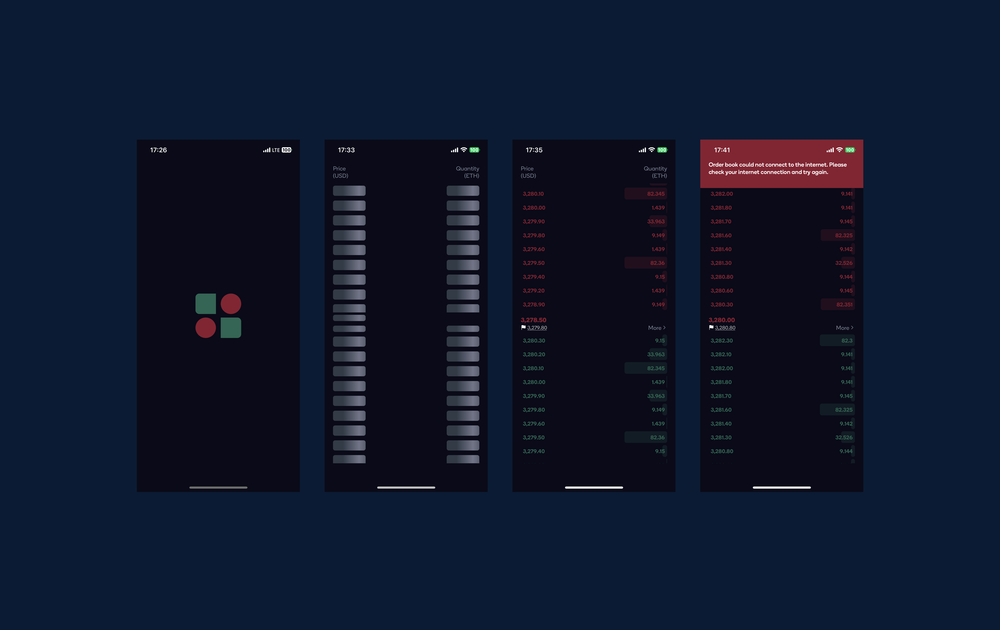

# OrderbookApp

<! ---  
  <h3 align="center">Orderly: Track Order Book</h3>

---

## Architecture

Orderly was built to run on particularly iOS and Android. It uses [Expo](https://expo.dev/) as a core lib to build and distribute to all the platforms.

## Contributing

Any bug reports, feature requests and other contributions are more than welcome!  
Whenever possible, please make a pull request with the implementation instead of just requesting it.

If the feature is big, open an issue first for discussion.

## Running locally

As others projects, you will need some requirements to run:

#### Requirements

- [Node.js](https://nodejs.org/) (latest)
- [Expo CLI](https://expo.dev/) (latest)
- [Yarn](https://yarnpkg.com/) (latest)

#### How to run

- `git clone git@github.com:vrinch/OrderbookApp.git`
- `yarn install`

Now, you can choose a command to run the project:

- `expo start` to run on iOS or Android simulator
- `expo start --ios` to run on iOS or Android simulator only
- `expo start --android` to run on Android simulator only

## Deploying

Expo EAS provides simple ways to build and deploy your app with singles commands:

## 📝 License

Copyright © 2022 [VRINCH](https://github.com/vrinch). 
This project is [MIT](https://github.com/vrinch/OrderbookApp/blob/main/LICENSE)
